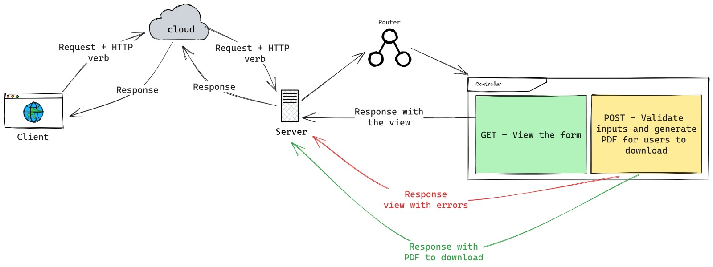

[](https://github.com/Fuensansano/proyecto/actions/workflows/ci.yml)
[](https://forge.laravel.com/servers/690000/sites/2005919)

<a rel="license" href="http://creativecommons.org/licenses/by-nc-nd/4.0/"></a><br />Este obra está bajo una <a rel="license" href="http://creativecommons.org/licenses/by-nc-nd/4.0/">licencia de Creative Commons Reconocimiento-NoComercial-SinObraDerivada 4.0 Internacional</a>.

# IES Ingeniero PDF generator



## Tech Documentation

### Tools we use

We use [Laravel Sail](https://laravel.com/docs/10.x/sail) to our local development
```bash
./vendor/bin/sail
```

To start docker with the logs
```bash
./vendor/bin/sail up
```

To start docker with logs on the background
```bash
./vendor/bin/sail up -d
```

To stop docker container
```bash
./vendor/bin/sail stop
```

To install the local dependencies
```bash
./vendor/bin/sail composer install
```

To update the local dependencies
```bash
./vendor/bin/sail composer update
```

Other artisan commands use with Sail
```bash
./vendor/bin/sail artisan livewire:publish
./vendor/bin/sail artisan optimize:clear
./vendor/bin/sail artisan view:clear
./vendor/bin/sail artisan route:clear
./vendor/bin/sail artisan config:clear
./vendor/bin/sail artisan view:cache
./vendor/bin/sail artisan route:cache
./vendor/bin/sail artisan storage:link
./vendor/bin/sail artisan up
```

To run npm and install all the dependencies
```bash
./vendor/bin/sail npm install
```

To run npm on our development environment
```bash
./vendor/bin/sail npm run dev
```

To build the project to push into production into our local environment
```bash
./vendor/bin/sail npm run build
```

Deployment script at [Forge](https://forge.laravel.com/)
```bash
composer install
php artisan livewire:publish

php artisan optimize:clear
php artisan view:clear
php artisan route:clear
php artisan config:clear
php artisan view:cache
php artisan route:cache
php artisan storage:link
php artisan up

npm install
npm run build
```

### ADRs
- [What are ADRs](https://adr.github.io/)
- [Examples of ADRs](https://github.com/joelparkerhenderson/architecture-decision-record)

#### Our ADRs
- [What PDF library to use](./docs/adr/adr-1-pdf-library.md)
- [Why pdf views can not be the same as the forms](./docs/adr/adr-2-split-printed-views.md)

## PDF Library
- [Dompdf](https://github.com/dompdf/dompdf)
